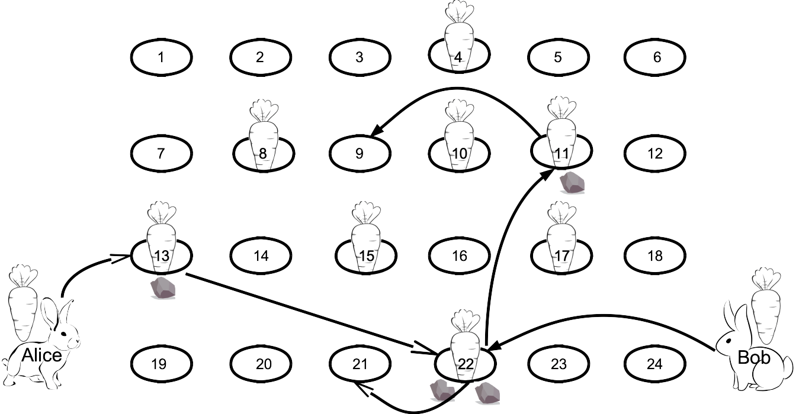

### The Rabbit Store

EVM's semantics requires that an account's detail can be read/written by its 20-byte address, and a storage slot can be read/written using (20-byte address, 32-byte hash) tuple.

See store/rabbit

RabbitStore is a special KV store which uses short fixed-length keys for indexing. We can replace MultiStore with it to reduce DRAM usage.

#### Rabbits hop to store and eat carrots

To explain how RabbitStore works, let's tell a story of rabbits first.

There are 24 holes, each of which can hold a carrot. Rabbits come and put their carrots into holes according to given algorithm. Suppose now eight rabbits have come and put eight carrots in eight holes. Then the Alice rabbit is coming with her carrot which is named as "Alice's yummy carrot". Alice will do the following steps according to the algorithm:

1. She hashes the name "Alice's yummy carrot" once and gets a number 13 . She hops to the #13 hole and finds another carrot in it. So her carrot cannot be stored in this hole.
2. She hashes the name twice and get a number 22. She hops to the #22 hole and finds another carrot in it. So her carrot cannot be stored in this hole either.
3. She hashes the name for three times and get a number 21. She hops to the #21 hole and finds an empty hole. So she can store "Alice's yummy carrot" in it.
4. She places one stone at #13 hole and one stone at #14 hole, which mean she must pass by these holes to reach the correct hole storing her carrot.

Finally, the Bob rabbit is coming with his carrot which is name as "Bob's delicious carrot". He does similar steps as Alice. He hops to #22 hole first, and then hops to #11 hole, finding these holes are full. At last he find an empty #9 hole. He stores his carrot in #9 and place two holes at #22 hole and #11 hole.

Now, we can see #13 hole and #11 hole each have one pass-by stone, and #22 hole has two pass-by stones.

When a rabbit comes to eat her carrot, she must follow these steps:

1. Set n = 1
2. Hash her carrot's name for n times and gets a hole number, and then check the hole:
3. If her carrot is not there and there is no pass-by stone, her carrot can never be found (maybe eaten by someone else)
4. If her carrot is not there and there are one or more pass-by stone, set n = n + 1 and go to step 2.
5. If her carrot is there, she eats it and removes one pass-by stone from each hole she just passed by.

If there are empty holes, a rabbit can finally find one hole to store her carrot in finite steps. And if the carrot is still there, a rabbit can finally find it to eat in finite steps.

#### Short fixed-length keys for indexing

The C++ version B-tree uses a special trick to reduce memory usage which only works when the key is 8 bytes long. But in practice, keys are usually quite long just like a carrot's lengthy name.

There are no more than 264 holes (because the key is 8 bytes long), and we must assign a hole number to some carrots with unique names. The number of carrots are far less than 264, but their names are much longer than 8.  The rabbits' hopping algorithm can help us map lengthy names to 8-byte hole number.

In the underlying TrunkStore, the keys are 8-byte which are calculated . And the original variable length key-value pairs are packed together and used as the values stored in TrunkStore

By hashing the original keys, RabbitStore gets new 8-byte short keys. By packing the original variable-length key and value together, RabbitStore gets new values. These new keys and values are stored into the underlying TrunkStore. Thus the indextree only faces fixed 8-byte short keys, which allows C++ B-tree to do the trick.

The short 8-byte keys generated from adjacent original keys, will no longer be adjacent to each other any more. So RabbitStore cannot support iteration. Luckily, EVM only uses SSTORE and SLOAD to access the underlying persistent KV store and it does not need iteration at all.

#### Performance Consideration

The possibility of rabbits' hopping path drops exponentially as its length grows. In practice, almost all of the hopping paths have only one hop. So the performance penalty of RabbitStore is negligible.

